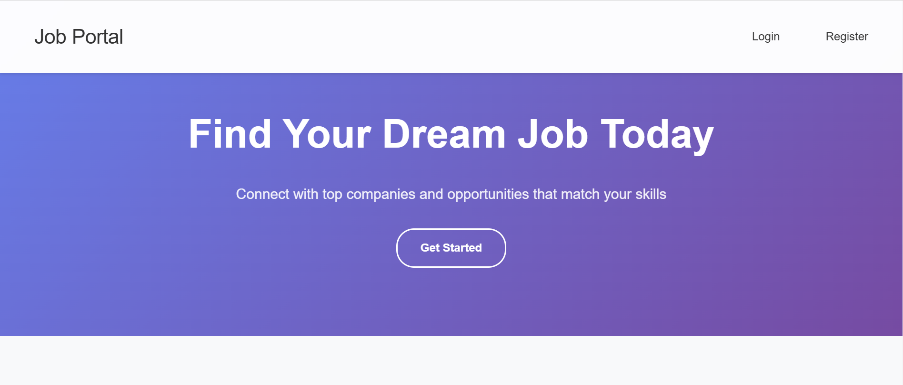
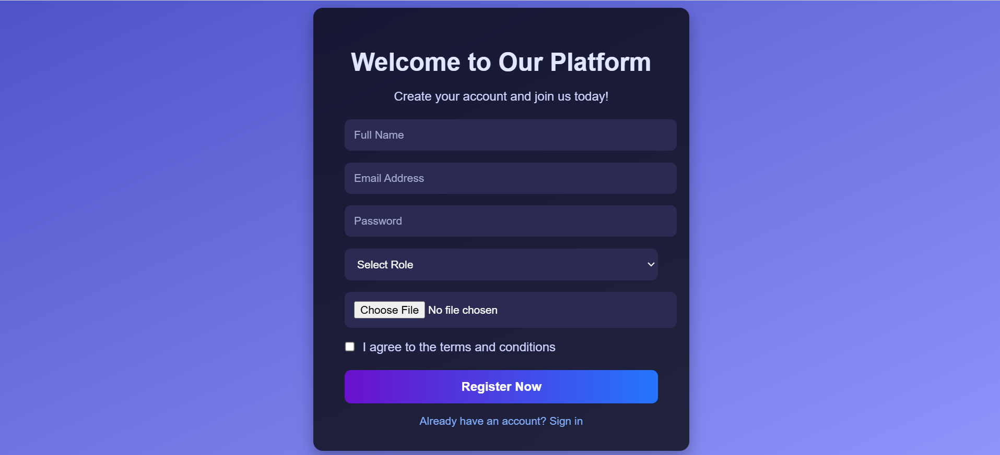
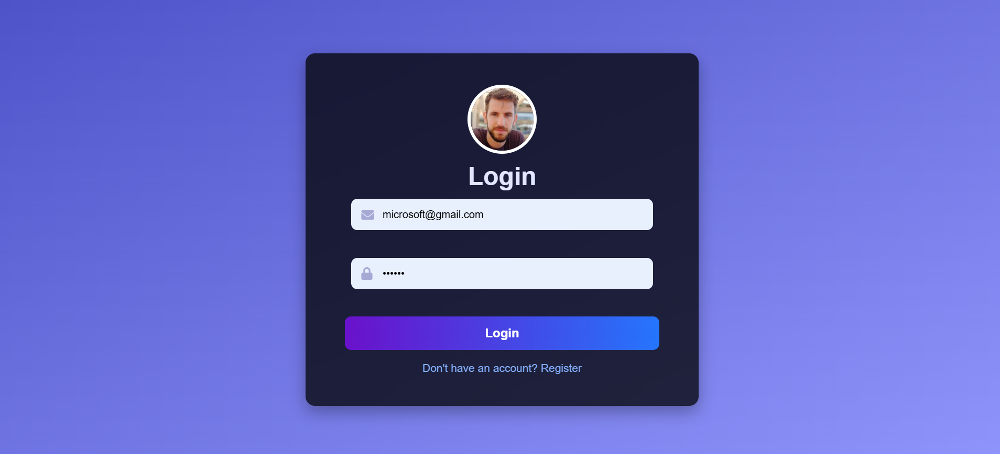
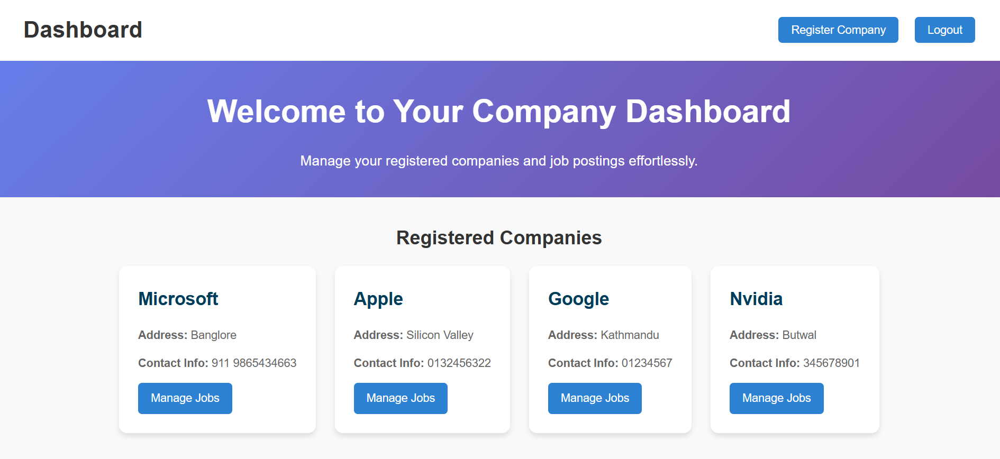

# Job Portal Application

A full-stack web application connecting job seekers with employers. Built with Node.js, Express, MySQL, and EJS templating.



Register page:


Login page:


Dashboard page:


There are many pages in the application, including: job seeker dashboard, job seeker login, job seeker register, Company dashboard, Company login, Company register, job posting, job seeker profile, job seeker resume and many more.

There are three main roles in the application:
1. **Job Seeker**: Users can create an account, upload their resume, and apply for jobs.
2. **Employer**: Users can create an account, post job openings, and view applications.
3. **Admin**: View job seeker account, company account, job postings, and manage the application.


## Features

- User authentication (Job Seeker & Employer)
- Job post creation and management
- Resume upload functionality
- Application tracking system
- Responsive web design
- Session-based authentication
- Secure password hashing
- RESTful API endpoints

## Technologies Used

## 🖥️ Frontend
-   
-   
-   

## ⚙️ Backend
-   
-   

## 🗄️ Database
-   
-   

## 📦 Dependencies
-  
-   
-  
-   
-  
-    
-   
-  

## 🛠️ Development Tools
-   
-   

## Installation

1. **Clone the repository**
   ```bash
   git clone https://github.com/kushpanthi/job-portal.git
   cd job-portal

2. **Install dependencies**

    ```bash
    npm install

3. **Database Setup**
   
- Create a new MySQL database and update the `config/config.js` file with your database credentials   
- Run the following command to create the database schema

- Create MySQL database:

    ```sql
    CREATE DATABASE job_portal;

- Run migrations:

    ```bash
    npx sequelize-cli db:migrate

4. **Configuration**

   Create .env file in root directory:

    ```.env
    PORT=3000
    JWT_SECRET=your_jwt_secret_key

6. **Start the development server**

    ```bash
    npm start

7. **Access the application**
   
   Visit http://localhost:3000 in your browser


